# 🏗️ Architecture Système

Documentation technique détaillée de l'architecture PDF Builder Pro.

## 📊 Vue d'Ensemble

PDF Builder Pro est construit selon une architecture modulaire MVC avec séparation claire des responsabilités :

```
┌─────────────────────────────────────────────────────────────┐
│                    Interface Utilisateur                    │
│  ┌─────────────────────────────────────────────────────┐    │
│  │  Admin Interface (WordPress Admin)                 │    │
│  │  ┌─────────────────────────────────────────────────┐ │    │
│  │  │  Template Editor (Canvas-based)                │ │    │
│  │  │  Settings & Configuration                      │ │    │
│  │  │  Analytics Dashboard                           │ │    │
│  │  └─────────────────────────────────────────────────┘ │    │
│  └─────────────────────────────────────────────────────┘    │
└─────────────────────────────────────────────────────────────┘
                                 │
                    API REST Layer
                                 │
┌─────────────────────────────────────────────────────────────┐
│                    Business Logic Layer                     │
│  ┌─────────────────────────────────────────────────────┐    │
│  │  Controllers: TemplateController, PDFController    │    │
│  │  Services: PDFGenerator, TemplateProcessor         │    │
│  │  Validators: DataValidator, SecurityValidator      │    │
│  └─────────────────────────────────────────────────────┘    │
└─────────────────────────────────────────────────────────────┘
                                 │
                    Data Access Layer
                                 │
┌─────────────────────────────────────────────────────────────┐
│                    Persistence Layer                        │
│  ┌─────────────────────────────────────────────────────┐    │
│  │  Database: Custom Tables (pdf_builder_*)          │    │
│  │  Cache: WordPress Object Cache + File Cache       │    │
│  │  Storage: Local File System + Cloud Storage       │    │
│  └─────────────────────────────────────────────────────┘    │
└─────────────────────────────────────────────────────────────┘
```

## 🗂️ Structure des Fichiers

### Organisation du Code Source

```
src/
├── Admin/                    # Interface d'administration
│   ├── Controllers/         # Contrôleurs admin
│   ├── Views/              # Templates d'interface
│   └── Assets/             # CSS/JS admin
├── Core/                    # Logique métier centrale
│   ├── Controllers/        # Contrôleurs API REST
│   ├── Services/           # Services métier
│   ├── Models/             # Modèles de données
│   └── Validators/         # Validation des données
├── Managers/                # Gestionnaires spécialisés
│   ├── TemplateManager.php # Gestion des templates
│   ├── PDFManager.php      # Gestion génération PDF
│   ├── CacheManager.php    # Gestion du cache
│   └── SecurityManager.php # Gestion sécurité
├── Models/                  # Modèles de données
│   ├── Template.php        # Modèle Template
│   ├── PDF.php            # Modèle PDF généré
│   └── User.php           # Modèle Utilisateur
└── Utilities/              # Utilitaires
    ├── FileHandler.php     # Gestion fichiers
    ├── ImageProcessor.php  # Traitement images
    └── Logger.php          # Logging système
```

### Structure de la Base de Données

#### Tables Principales

```sql
-- Templates de PDF
CREATE TABLE wp_pdf_builder_templates (
    id BIGINT UNSIGNED AUTO_INCREMENT PRIMARY KEY,
    name VARCHAR(255) NOT NULL,
    description TEXT,
    elements LONGTEXT NOT NULL, -- JSON des éléments
    settings LONGTEXT, -- JSON des paramètres
    created_by BIGINT UNSIGNED NOT NULL,
    created_at TIMESTAMP DEFAULT CURRENT_TIMESTAMP,
    updated_at TIMESTAMP DEFAULT CURRENT_TIMESTAMP ON UPDATE CURRENT_TIMESTAMP,
    status ENUM('active', 'inactive', 'draft') DEFAULT 'active',
    INDEX idx_created_by (created_by),
    INDEX idx_status (status)
);

-- PDFs générés
CREATE TABLE wp_pdf_builder_pdfs (
    id BIGINT UNSIGNED AUTO_INCREMENT PRIMARY KEY,
    template_id BIGINT UNSIGNED NOT NULL,
    data LONGTEXT, -- JSON des données utilisées
    file_path VARCHAR(500),
    file_url VARCHAR(500),
    file_size INT UNSIGNED,
    generated_by BIGINT UNSIGNED,
    generated_at TIMESTAMP DEFAULT CURRENT_TIMESTAMP,
    expires_at TIMESTAMP NULL,
    download_count INT DEFAULT 0,
    FOREIGN KEY (template_id) REFERENCES wp_pdf_builder_templates(id) ON DELETE CASCADE,
    INDEX idx_template_id (template_id),
    INDEX idx_generated_by (generated_by),
    INDEX idx_expires_at (expires_at)
);

-- Métriques et analytics
CREATE TABLE wp_pdf_builder_metrics (
    id BIGINT UNSIGNED AUTO_INCREMENT PRIMARY KEY,
    event_type VARCHAR(100) NOT NULL,
    event_data LONGTEXT, -- JSON des données de l'événement
    user_id BIGINT UNSIGNED,
    ip_address VARCHAR(45),
    user_agent TEXT,
    created_at TIMESTAMP DEFAULT CURRENT_TIMESTAMP,
    INDEX idx_event_type (event_type),
    INDEX idx_user_id (user_id),
    INDEX idx_created_at (created_at)
);

-- Cache des templates
CREATE TABLE wp_pdf_builder_cache (
    cache_key VARCHAR(255) PRIMARY KEY,
    cache_value LONGTEXT,
    cache_group VARCHAR(100),
    expires_at TIMESTAMP,
    created_at TIMESTAMP DEFAULT CURRENT_TIMESTAMP,
    INDEX idx_cache_group (cache_group),
    INDEX idx_expires_at (expires_at)
);
```

## 🔄 Flux de Données

### Génération d'un PDF

```mermaid
sequenceDiagram
    participant U as Utilisateur
    participant API as API REST
    participant C as Controller
    participant V as Validator
    participant TM as TemplateManager
    participant PM as PDFManager
    participant DB as Base de Données
    participant FS as File System

    U->>API: POST /generate
    API->>C: generatePDF()
    C->>V: validateRequest()
    V-->>C: validation OK
    C->>TM: getTemplate()
    TM->>DB: SELECT template
    DB-->>TM: template data
    TM-->>C: template object
    C->>PM: generate()
    PM->>PM: processElements()
    PM->>PM: renderPDF()
    PM->>FS: saveFile()
    FS-->>PM: file path
    PM->>DB: INSERT pdf_record
    DB-->>PM: pdf_id
    PM-->>C: pdf_url
    C-->>API: success response
    API-->>U: PDF URL
```



### Création d'un Template

```mermaid
sequenceDiagram
    participant U as Utilisateur
    participant API as API REST
    participant C as Controller
    participant V as Validator
    participant TM as TemplateManager
    participant DB as Base de Données

    U->>API: POST /templates
    API->>C: createTemplate()
    C->>V: validateTemplateData()
    V-->>C: validation OK
    C->>TM: create()
    TM->>TM: sanitizeElements()
    TM->>DB: INSERT template
    DB-->>TM: template_id
    TM->>TM: clearCache()
    TM-->>C: template object
    C-->>API: success response
    API-->>U: template data
```



## 🏭 Services et Gestionnaires

### TemplateManager

```php
class TemplateManager {

    private $cache;
    private $validator;

    public function __construct() {
        $this->cache = new CacheManager();
        $this->validator = new TemplateValidator();
    }

    /**
     * Récupère un template par ID avec cache
     */
    public function getTemplate(int $id): ?Template {
        $cacheKey = "template_{$id}";

        // Vérifier le cache
        $cached = $this->cache->get($cacheKey, 'templates');
        if ($cached) {
            return $cached;
        }

        // Récupérer depuis la DB
        $template = $this->fetchFromDatabase($id);

        if ($template) {
            // Mettre en cache
            $this->cache->set($cacheKey, $template, 'templates', 3600);
        }

        return $template;
    }

    /**
     * Crée un nouveau template
     */
    public function createTemplate(array $data): Template {
        // Validation
        $this->validator->validate($data);

        // Sanitisation
        $data = $this->sanitizeTemplateData($data);

        // Insertion en DB
        $id = $this->insertIntoDatabase($data);

        // Invalidation du cache
        $this->cache->invalidateGroup('templates');

        return new Template($id, $data);
    }

    /**
     * Met à jour un template
     */
    public function updateTemplate(int $id, array $data): bool {
        // Validation
        $this->validator->validateUpdate($id, $data);

        // Sanitisation
        $data = $this->sanitizeTemplateData($data);

        // Mise à jour DB
        $updated = $this->updateInDatabase($id, $data);

        if ($updated) {
            // Invalidation du cache spécifique
            $this->cache->delete("template_{$id}", 'templates');
        }

        return $updated;
    }
}
```

### PDFManager

```php
class PDFManager {

    private $tcpdf;
    private $templateProcessor;
    private $fileHandler;

    public function __construct() {
        $this->tcpdf = new TCPDF();
        $this->templateProcessor = new TemplateProcessor();
        $this->fileHandler = new FileHandler();
    }

    /**
     * Génère un PDF depuis un template et des données
     */
    public function generatePDF(Template $template, array $data): GeneratedPDF {
        // Configuration TCPDF
        $this->configureTCPDF($template);

        // Traitement des éléments du template
        $processedElements = $this->templateProcessor->processElements(
            $template->getElements(),
            $data
        );

        // Rendu des éléments
        foreach ($processedElements as $element) {
            $this->renderElement($element);
        }

        // Génération du fichier
        $filename = $this->generateFilename($template, $data);
        $filePath = $this->fileHandler->savePDF($this->tcpdf, $filename);

        // Enregistrement en base
        $pdfRecord = $this->savePDFRecord($template->getId(), $data, $filePath);

        return new GeneratedPDF($pdfRecord);
    }

    /**
     * Configure TCPDF selon les paramètres du template
     */
    private function configureTCPDF(Template $template): void {
        $settings = $template->getSettings();

        $this->tcpdf->SetCreator('PDF Builder Pro');
        $this->tcpdf->SetAuthor(get_bloginfo('name'));
        $this->tcpdf->SetTitle($template->getName());

        // Format de page
        $format = $settings['format'] ?? 'A4';
        $orientation = $settings['orientation'] ?? 'P';
        $this->tcpdf->AddPage($format, $orientation);

        // Marges
        $margins = $settings['margins'] ?? ['top' => 10, 'right' => 10, 'bottom' => 10, 'left' => 10];
        $this->tcpdf->SetMargins($margins['left'], $margins['top'], $margins['right']);
        $this->tcpdf->SetAutoPageBreak(true, $margins['bottom']);
    }

    /**
     * Rend un élément dans le PDF
     */
    private function renderElement(array $element): void {
        switch ($element['type']) {
            case 'text':
                $this->renderTextElement($element);
                break;
            case 'image':
                $this->renderImageElement($element);
                break;
            case 'table':
                $this->renderTableElement($element);
                break;
            // ... autres types d'éléments
        }
    }
}
```

## 🔒 Sécurité

### Architecture de Sécurité

```php
class SecurityManager {

    private $rateLimiter;
    private $inputValidator;
    private $auditLogger;

    public function __construct() {
        $this->rateLimiter = new RateLimiter();
        $this->inputValidator = new InputValidator();
        $this->auditLogger = new AuditLogger();
    }

    /**
     * Valide une requête API
     */
    public function validateAPIRequest(WP_REST_Request $request): bool {
        // Vérification rate limiting
        if (!$this->rateLimiter->checkLimit($request)) {
            throw new RateLimitExceededException();
        }

        // Validation de l'authentification
        if (!$this->validateAuthentication($request)) {
            throw new AuthenticationException();
        }

        // Validation des permissions
        if (!$this->validatePermissions($request)) {
            throw new PermissionDeniedException();
        }

        // Validation des données d'entrée
        if (!$this->inputValidator->validate($request->get_params())) {
            throw new ValidationException();
        }

        // Log de l'accès
        $this->auditLogger->logAccess($request);

        return true;
    }

    /**
     * Nettoie les données utilisateur
     */
    public function sanitizeUserData(array $data): array {
        return array_map(function($value) {
            if (is_string($value)) {
                return wp_kses_post($value); // Permet HTML de base
            }
            if (is_array($value)) {
                return $this->sanitizeUserData($value);
            }
            return $value;
        }, $data);
    }

    /**
     * Valide les permissions utilisateur
     */
    private function validatePermissions(WP_REST_Request $request): bool {
        $user = wp_get_current_user();
        $endpoint = $request->get_route();

        // Permissions basées sur les routes
        $permissions = [
            '/pdf-builder/v1/templates' => 'pdf_builder_edit_templates',
            '/pdf-builder/v1/generate' => 'pdf_builder_generate_pdf',
            '/pdf-builder/v1/analytics' => 'pdf_builder_view_analytics'
        ];

        if (isset($permissions[$endpoint])) {
            return user_can($user, $permissions[$endpoint]);
        }

        return false;
    }
}
```

### Rate Limiting

```php
class RateLimiter {

    private $redis;
    private $limits = [
        'generate' => ['max' => 100, 'window' => 3600], // 100 par heure
        'templates' => ['max' => 50, 'window' => 3600],  // 50 par heure
        'admin' => ['max' => 1000, 'window' => 3600]     // 1000 par heure
    ];

    public function checkLimit(WP_REST_Request $request): bool {
        $user_id = get_current_user_id();
        $endpoint = $request->get_route();
        $ip = $this->getClientIP();

        $key = $this->getRateLimitKey($user_id, $ip, $endpoint);
        $limit = $this->getLimitForEndpoint($endpoint);

        // Utiliser Redis pour le stockage
        $current = $this->redis->get($key) ?: 0;

        if ($current >= $limit['max']) {
            return false;
        }

        // Incrémenter le compteur
        $this->redis->incr($key);
        $this->redis->expire($key, $limit['window']);

        return true;
    }

    private function getRateLimitKey($user_id, $ip, $endpoint): string {
        $identifier = $user_id ?: $ip;
        return "pdf_builder_rate_limit:{$identifier}:{$endpoint}";
    }

    private function getLimitForEndpoint(string $endpoint): array {
        if (strpos($endpoint, '/generate') !== false) {
            return $this->limits['generate'];
        }
        if (strpos($endpoint, '/admin') !== false) {
            return $this->limits['admin'];
        }
        return $this->limits['templates'];
    }
}
```

## 💾 Cache et Performance

### Stratégie de Cache Multi-Niveau

```php
class CacheManager {

    private $wordpress_cache;
    private $file_cache;
    private $redis_cache;

    public function __construct() {
        $this->wordpress_cache = new WordPressCache();
        $this->file_cache = new FileCache();
        $this->redis_cache = new RedisCache();
    }

    /**
     * Récupère une valeur du cache
     */
    public function get(string $key, string $group = 'default') {
        // Niveau 1: Cache WordPress (mémoire)
        $value = $this->wordpress_cache->get($key, $group);
        if ($value !== false) {
            return $value;
        }

        // Niveau 2: Cache Redis (si disponible)
        if ($this->redis_cache->isAvailable()) {
            $value = $this->redis_cache->get($key, $group);
            if ($value !== false) {
                // Remettre dans le cache WordPress
                $this->wordpress_cache->set($key, $value, $group);
                return $value;
            }
        }

        // Niveau 3: Cache fichier
        $value = $this->file_cache->get($key, $group);
        if ($value !== false) {
            // Remettre dans les caches supérieurs
            $this->wordpress_cache->set($key, $value, $group);
            if ($this->redis_cache->isAvailable()) {
                $this->redis_cache->set($key, $value, $group);
            }
            return $value;
        }

        return false;
    }

    /**
     * Stocke une valeur en cache
     */
    public function set(string $key, $value, string $group = 'default', int $ttl = 3600): bool {
        // Stocker dans tous les niveaux
        $success = true;

        $success &= $this->wordpress_cache->set($key, $value, $group, $ttl);

        if ($this->redis_cache->isAvailable()) {
            $success &= $this->redis_cache->set($key, $value, $group, $ttl);
        }

        $success &= $this->file_cache->set($key, $value, $group, $ttl);

        return $success;
    }

    /**
     * Invalide un groupe de cache
     */
    public function invalidateGroup(string $group): void {
        $this->wordpress_cache->flush_group($group);

        if ($this->redis_cache->isAvailable()) {
            $this->redis_cache->deleteByPattern("*:{$group}:*");
        }

        $this->file_cache->clearGroup($group);
    }
}
```

### Optimisations de Performance

```php
class PerformanceOptimizer {

    /**
     * Optimise la génération PDF pour les gros volumes
     */
    public function optimizeBulkGeneration(array $requests): array {
        // Grouper par template pour réduire les chargements
        $grouped = $this->groupByTemplate($requests);

        $results = [];

        foreach ($grouped as $template_id => $template_requests) {
            // Charger le template une seule fois
            $template = $this->templateManager->getTemplate($template_id);

            // Traiter les requêtes en parallèle si possible
            $batch_results = $this->processBatch($template, $template_requests);
            $results = array_merge($results, $batch_results);
        }

        return $results;
    }

    /**
     * Précharge les templates fréquemment utilisés
     */
    public function preloadFrequentTemplates(): void {
        global $wpdb;

        // Identifier les templates les plus utilisés (dernière semaine)
        $frequent_templates = $wpdb->get_col($wpdb->prepare("
            SELECT template_id
            FROM {$wpdb->prefix}pdf_builder_pdfs
            WHERE generated_at > DATE_SUB(NOW(), INTERVAL 7 DAY)
            GROUP BY template_id
            ORDER BY COUNT(*) DESC
            LIMIT 10
        "));

        // Précharger en cache
        foreach ($frequent_templates as $template_id) {
            $this->templateManager->getTemplate($template_id);
        }
    }

    /**
     * Optimise les images pour le PDF
     */
    public function optimizeImages(array $elements): array {
        return array_map(function($element) {
            if ($element['type'] === 'image' && isset($element['src'])) {
                $optimized_src = $this->imageProcessor->optimizeForPDF($element['src']);
                $element['src'] = $optimized_src;
            }
            return $element;
        }, $elements);
    }
}
```

## 🔧 API REST

### Structure des Endpoints

```php
class PDF_Builder_REST_Controller extends WP_REST_Controller {

    public function register_routes() {
        // Templates
        register_rest_route('pdf-builder/v1', '/templates', [
            [
                'methods' => WP_REST_Server::READABLE,
                'callback' => [$this, 'get_templates'],
                'permission_callback' => [$this, 'get_templates_permissions_check'],
                'args' => $this->get_collection_params()
            ],
            [
                'methods' => WP_REST_Server::CREATABLE,
                'callback' => [$this, 'create_template'],
                'permission_callback' => [$this, 'create_template_permissions_check'],
                'args' => $this->get_template_params()
            ]
        ]);

        // Template individuel
        register_rest_route('pdf-builder/v1', '/templates/(?P<id>\d+)', [
            [
                'methods' => WP_REST_Server::READABLE,
                'callback' => [$this, 'get_template'],
                'permission_callback' => [$this, 'get_template_permissions_check'],
                'args' => ['id' => ['required' => true, 'type' => 'integer']]
            ],
            [
                'methods' => WP_REST_Server::EDITABLE,
                'callback' => [$this, 'update_template'],
                'permission_callback' => [$this, 'update_template_permissions_check'],
                'args' => $this->get_template_params()
            ],
            [
                'methods' => WP_REST_Server::DELETABLE,
                'callback' => [$this, 'delete_template'],
                'permission_callback' => [$this, 'delete_template_permissions_check']
            ]
        ]);

        // Génération PDF
        register_rest_route('pdf-builder/v1', '/generate', [
            'methods' => WP_REST_Server::CREATABLE,
            'callback' => [$this, 'generate_pdf'],
            'permission_callback' => [$this, 'generate_pdf_permissions_check'],
            'args' => $this->get_generate_params()
        ]);

        // Analytics
        register_rest_route('pdf-builder/v1', '/analytics', [
            'methods' => WP_REST_Server::READABLE,
            'callback' => [$this, 'get_analytics'],
            'permission_callback' => [$this, 'get_analytics_permissions_check'],
            'args' => $this->get_analytics_params()
        ]);
    }

    /**
     * Validation des paramètres de génération
     */
    public function get_generate_params() {
        return [
            'template_id' => [
                'required' => true,
                'type' => 'integer',
                'minimum' => 1
            ],
            'data' => [
                'required' => true,
                'type' => 'object'
            ],
            'options' => [
                'type' => 'object',
                'properties' => [
                    'filename' => ['type' => 'string'],
                    'format' => ['enum' => ['PDF', 'PNG', 'JPG']],
                    'compression' => ['enum' => ['NONE', 'NORMAL', 'HIGH']]
                ]
            ]
        ];
    }
}
```

---

**📖 Voir aussi :**
- [API Endpoints](../api/endpoints.md)
- [Configuration](../technical/configuration.md)
- [Sécurité](../technical/security.md)